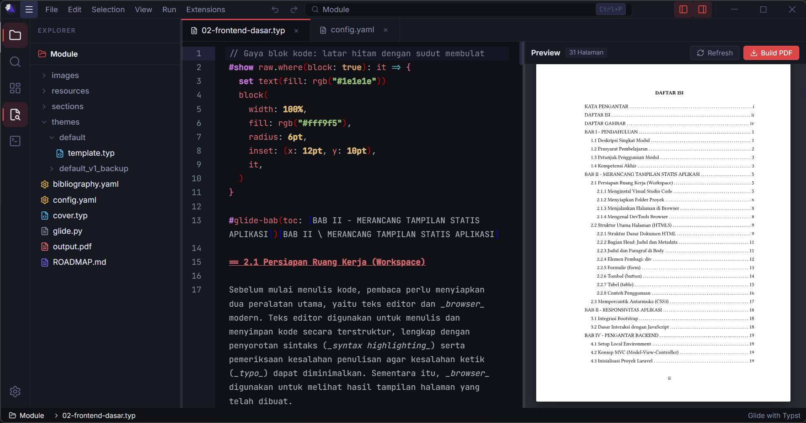

# Glide

> **Generative Layout Integrated Document Engine**

Glide 2.0 adalah aplikasi desktop modern berbasis **Electron**, **Vue 3**, dan **Typst** yang dirancang khusus untuk memudahkan penyusunan dan penulisan dokumen akademik formal, modul, tugas akhir, dan jurnalilmiah secara cepat, presisi, dan indah dengan dukungan AI CLI melalui skill dan konteks file yang lebih mudah dipahami AI.


---

## Fitur Utama

- **Live Typst Preview**: Pratinjau dokumen Typst real-time dengan render cepat berbasis SVG.
- **Manajemen Proyek & Multi-Tab**: Pengelolaan struktur bab (`cover.typ`, `sections/*`, `config.yaml`) dengan antarmuka tab editor intuitif. File dipisah menjadi beberapa bagian sehingga memberikan ekstra konteks untuk pemahaman AI, dan AI tidak perlu membaca semua isi yang banyak langsung.
- **Sistem Tema & Config YAML**: Pengaturan margin, font, warna aksen, dan gaya penomoran halaman yang tersentralisasi berbasis config.yaml.
- **Pandoc DOCX Export**: Ekspor dokumen Typst ke Microsoft Word (`.docx`) menggunakan *reference.docx style template*, daftar isi (TOC) native, dan paragraf justify.
- **Shortcut dan Command Pallete**: Ketik : di text editor dan akan muncul semua shorcut elemen, dan pencarian cepat melalui command pallete untuk mengakses fitur / navigasi file (`Ctrl+P` / `Ctrl+Shift+P`).
- **Media & File Explorer**: Dukungan peninjauan gambar, audio, video, dan berkas pendukung langsung di dalam editor dan file explorer untuk mempermudah pencarian teks/file.



---

## Teknologi yang Digunakan

Menggunakan Electron dan Node.js, dengan frontend Vue 3, Vue 3 (Composition API, TypeScript), Vite, dan CodeMirror 6. Aplikasi ini menggunakan Typst CLI untuk compile Typst menjadi PDF, dan Pandoc untuk convert Typst ke DOCX.

---

## Panduan Memulai

### Prasyarat
- [Node.js](https://nodejs.org/) (v18 atau lebih baru)
- [Typst CLI](https://github.com/typst/typst) atau jalankan:
```bash
winget install typst
```
- [Pandoc](https://pandoc.org/) (Diperlukan untuk ekspor ke Word `.docx`)

### Instalasi & Menjalankan

1. **Clone repository ini**:
   ```bash
   git clone https://github.com/FloatyCandy/Glide.git
   cd Glide
   ```

2. **Install Dependensi**:
   ```bash
   npm install
   ```

3. **Jalankan Aplikasi Mode Development**:
   ```bash
   npm run dev
   ```

---

## Build Installer Aplikasi

Untuk membangun installer desktop untuk OS Windows (`.exe` / NSIS):

```bash
npm run build
```

Hasil build akan berada di folder `dist-app/`.

---

## Lisensi

Hak Cipta © 2026 **Glide Team / FloatyCandy**.
Dipublikasikan di bawah lisensi MIT.
